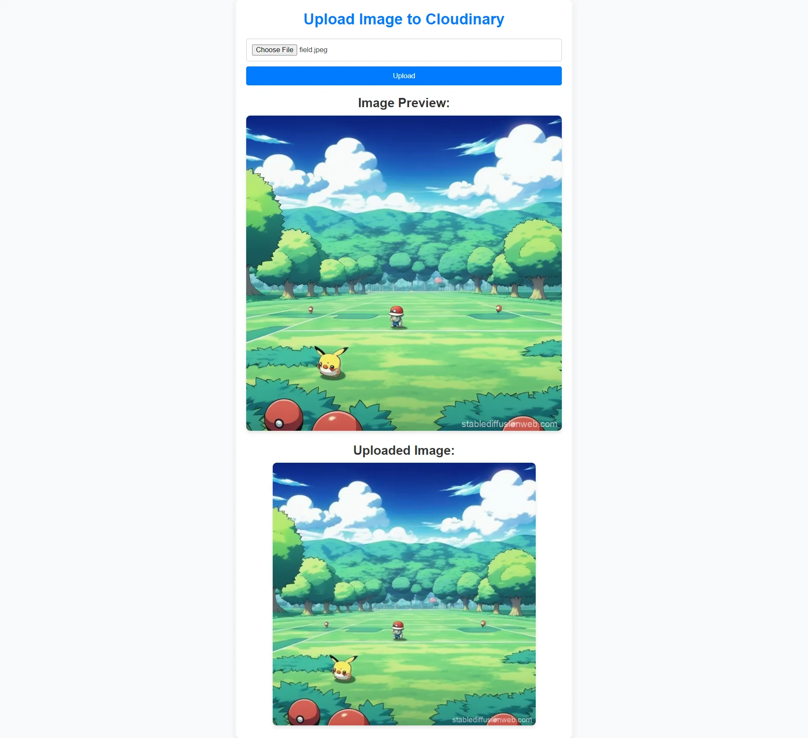

# input_image_use_cloudinary

stack vite(react) + express js + MongoDB
use cloudinary for save image

cd frontend
npm install

npx nodemon server.js              for run server

This is website input_image_use_cloudinary

